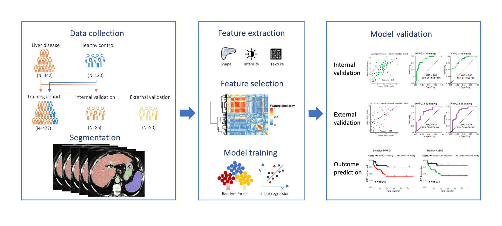

# RADIPOP   CT Radiomics for Portal Hypertension

This repository accompanies the manuscript 

> Radiomics-based assessment of portal hypertension severity and risk stratification of cirrhotic patients using routine CT scans 
>
> Celine Sin, Martin L. Watzenboeck, Eugenia Iofinova, Lorenz Balcar, Georg Semmler, Bernhard Scheiner, Katharina Lampichler, Mattias Mandorfer, Lucile Moga, Pierre-Emmanuel Rautou, Maxime Ronot, Jörg Menche, Thomas Reiberger, Martina Scharitzer

This repository contains scripts and tools for radiomics analysis used in the study, including image processing, feature extraction, feature selection, and model training.

Additional related scripts for the feature extraction of the training cohort are available at [https://github.com/menchelab/radipop_scripts](https://github.com/menchelab/radipop_scripts).

Our custom segmentation software can be provided upon request.

<!-- 
 -->

 



### Main content

Most important scripts with which the analysis of this manuscript are
- [`RADIPOP_extract_features_external_validation.ipynb`](notebooks/RADIPOP_extract_features_external_validation.ipynb)
  This Jupyter notebook was used for preprocessing and feature extraction of the external validation cohort with the same methodology as used for the [training cohort](https://github.com/menchelab/radipop_scripts)

- [`RADIPOP_model_training.ipynb`](notebooks/RADIPOP_model_training.ipynb)
  This Jupyter notebook performs feature reduction, hyperparameter selection as well as model training and evaluation on internal and external validation cohorts.
  Feature reduction is performed by calculating pairwise Spearman correlations between individual features and hierarchical clustering. The threshold (i.e., height at which the dendrogram was cut) to form clusters is considered a hyperparameter. Hyperparameter selection for random forest or elastic net regression models is performed using Bayesian Optimization.

- [`RADIPOP_analysis.Rmd`](R/RADIPOP_analysis.Rmd) 
  This RMarkdown notebook contains analysis and visualization steps for model performance evaluation on internal and external validation cohorts. Furthermore, the power of HVPG predicted by radiomic features ("radio-HVPG") versus invasively measured HVPG to predict a composite endpoint of cirrhosis decompensation/liver-related death is evaluated.


## Install instructions: 


Most of the code is in our python package `radipop_utils` which comes with an appropriate `pyproject.toml` file, which specifies the dependencies. 
This allows you to install it simply with 
```
pip install -e .
```


### Further content 
Moreover, we provide a pipeline and a brief tutorial how to make a similar analysis with your own data in: [tutorials/](tutorials). *Note:* This part is currently under development.


