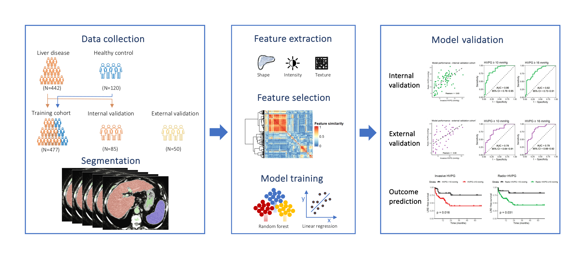

# RADIPOP   CT Radiomics for Portal Hypertension

This repository accompanies the manuscript 

> Radiomics-based assessment of portal hypertension severity and risk stratification of cirrhotic patients using routine CT scans 
>
> Celine Sin, Martin L. Watzenboeck, Eugenia Iofinova, Lorenz Balcar, Georg Semmler, Bernhard Scheiner, Katharina Lampichler, Mattias Mandorfer, Lucile Moga, Pierre-Emmanuel Rautou, Maxime Ronot, Jörg Menche, Thomas Reiberger, Martina Scharitzer

This repository contains scripts and tools for radiomics analysis used in the study, including image processing, feature extraction, feature selection, and model training.

Additional related scripts for the feature extraction of the training cohort are available at [https://github.com/menchelab/radipop_scripts](https://github.com/menchelab/radipop_scripts).

Our custom segmentation software can be provided upon request.

<!-- 
 -->

 



### Main content

The most important scripts with which the analysis steps in the manuscript above can be recreated:
- [`RADIPOP_extract_features_external_validation.ipynb`](notebooks/RADIPOP_extract_features_external_validation.ipynb)
  This Jupyter notebook was used for preprocessing and feature extraction of the external validation cohort with the same methodology as used for the [training cohort](https://github.com/menchelab/radipop_scripts)

- [`RADIPOP_model_training.ipynb`](notebooks/RADIPOP_model_training.ipynb)
  This Jupyter notebook performs feature reduction, hyperparameter selection as well as model training and evaluation on internal and external validation cohorts.
  Feature reduction is performed by calculating pairwise Spearman correlations between individual features and hierarchical clustering. The threshold (i.e., height at which the dendrogram was cut) to form clusters is considered a hyperparameter. Hyperparameter selection for random forest or elastic net regression models is performed using Bayesian Optimization.

- [`RADIPOP_analysis.Rmd`](R/RADIPOP_analysis.Rmd) 
  This RMarkdown notebook contains analysis and visualization steps for model performance evaluation on internal and external validation cohorts. Furthermore, the power of HVPG predicted by radiomic features ("radio-HVPG") versus invasively measured HVPG to predict a composite endpoint of cirrhosis decompensation/liver-related death is evaluated.


## Installation Instructions

### Prerequisites

- Python 3.7 or higher
- pip or conda package manager

### Basic Installation (Core Functionality)

The core package can be installed with pip. This includes all essential dependencies for radiomics feature extraction, model training, and inference (without automatic segmentation).

#### Using pip:

```bash
# Clone the repository
git clone https://github.com/mlwatzenboeck/RADIPOP.git
cd RADIPOP

# Install in editable mode
pip install -e .
```

#### Using conda (Recommended):

```bash
# Create a new conda environment
conda create -n radipop python=3.9
conda activate radipop

# Install the package
pip install -e .
```

### Optional Dependencies

#### Automatic Segmentation (TotalSegmentator)

For automatic segmentation using TotalSegmentator, install the optional `torch` dependencies:

```bash
pip install radipop_utils[torch]
```

**Note:** This will install PyTorch and TotalSegmentator, which are large packages. Only install if you need automatic segmentation functionality.

#### DICOM to NIfTI Conversion

For DICOM to NIfTI conversion using `dicom2nifti`:

```bash
pip install radipop_utils[dicom2nifti]
```

**Note:** The package also includes `dcm2niix` as an alternative for DICOM conversion, which is installed by default.

#### All Optional Dependencies

To install all optional dependencies:

```bash
pip install radipop_utils[all]
```

### Verify Installation

After installation, verify that all core modules can be imported:

```bash
python test_imports.py
```

This script will test all core imports and report on optional dependencies. The core functionality should work even if optional dependencies are not installed.

### Troubleshooting

If you encounter dependency conflicts:

1. **scikit-optimize compatibility issues**: The package pins compatible versions. If issues persist, try:
   ```bash
   pip install scikit-optimize>=0.9.0
   ```

2. **numpy compatibility**: The package requires `numpy>=1.21.0,<2.0.0`. If you have conflicts, create a fresh environment:
   ```bash
   conda create -n radipop python=3.9
   conda activate radipop
   pip install -e .
   ```

3. **dicom2nifti errors**: If you see `ModuleNotFoundError: No module named 'pydicom.pixels'`, this is a known compatibility issue. Either:
   - Install the optional dependency: `pip install radipop_utils[dicom2nifti]` (may require compatible pydicom version)
   - Use `dcm2niix` instead (already included in core dependencies)


### Further content 
Moreover, we provide a pipeline and a brief tutorial how to make a similar analysis with your own data in: [tutorials/](tutorials). *Note:* This part is currently under development.


