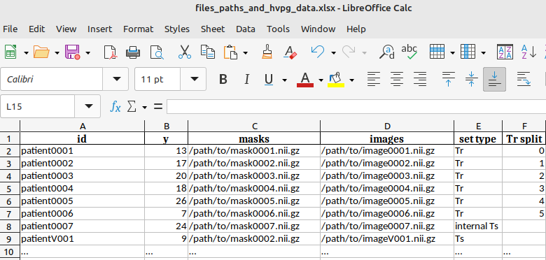

# RADIPOP   CT Radiomics for Portal Hypertension

 

## Install instructions: 


Most of the code is in our python package `radipop_utils` which comes with an appropriate `pyproject.toml` file, which specifies the dependencies. 
This allows you to install it simply with 
```
pip install -e .
```

<!-- 
## Example `.env`

The path to the dataset in the provided sample notebooks read from a `.env` file. 
This will be different for your dataset. Please create a `.env` file with the following entires, or change the notebooks accordingly
```bash
local_user=cwatzenboeck
DATA_ROOT_DIRECTORY=/home/${local_user}/data/cirdata
```
or store them as environment variables.


```python
# OPTION 1:  
# Load environment variables from .env file if it exists 
from dotenv import load_dotenv
load_dotenv()

# OPTION 2:
from dotenv import dotenv_values

config = dotenv_values(".env"),  # load environment variables as dictionary
``` -->

_________________

## TODOS
Just some notes so that I don't forget. 

### Ongoing
- [x] Add `.yaml` files for the `pyradiomics` settigs and describe in more detail
- [ ] Freeze environment and add as [requirements.txt](requirements.txt)
- [ ] Create pipeline
  - [x] Feature extraction as a tool:
  - [ ] Prediction as a tool 

### Completed Column ✓
- [x] Refactor and change to package


_________________

## Usage instructions: 

After installing the `radipop_utils` utils package the following commands are available: 

-  `radipop_suggest_binwidth`-- Estimate a reasonable BinWidth for the radiomics settings of your data
- `radipop_extract_features`  -- Can be used to extract the radiomics feature from single CT images/ masks. 
- `radipop_extract_features_many_times` -- Can be used to extract the radiomics feature from  CT images.
- `radipop_predict` -- TODO!!


## Preliminaries: 

For the suggested workflow you need: 

TODO 


The file with the path-names for the images and masks for `radipop_extract_features_many_times --images_and_mask_paths_file <this file>` as well as the training should look like this: 





```bash
$ radipop_extract_features --help 

usage: radipop_extract_features [-h] [--patientid PATIENTID] [--image IMAGE] [--masks MASKS] [--output_dir OUTPUT_DIR] [--fe_settings FE_SETTINGS]

Extract and save radiomics features from NIfTI images.

optional arguments:
  -h, --help            show this help message and exit
  --patientid PATIENTID
                        Name of the newly created output folder
  --image IMAGE         Path to image in .nii format
  --masks MASKS         Path to masks in .nii format; in mask 1=liver; 2=spleen; 0=other
  --output_dir OUTPUT_DIR
                        Directory where the extracted features will be saved.
  --fe_settings FE_SETTINGS
                        Path to the radiomics feature extraction settings file.
```


```bash
$ radipop_extract_features_many_times --help 

usage: radipop_extract_features_many_times [-h] [--images_and_mask_paths_file IMAGES_AND_MASK_PATHS_FILE] [--output_dir OUTPUT_DIR] [--fe_settings FE_SETTINGS]

Extract and save radiomics features from NIfTI images (paths provided as an xlsx file.)

optional arguments:
  -h, --help            show this help message and exit
  --images_and_mask_paths_file IMAGES_AND_MASK_PATHS_FILE
                        Path to the Excel file containing image and mask paths and patient IDs.
  --output_dir OUTPUT_DIR
                        Directory where the extracted features will be saved.
  --fe_settings FE_SETTINGS
                        Path to the radiomics feature extraction settings file.
```


Example:
--------


```bash
radipop_extract_features --patientid patient0001 \
 --image /home/cwatzenboeck/data/cirdata/nnUNet_raw/Dataset125_LSS/imagesAll/patient0001_0000.nii.gz \
 --masks /home/cwatzenboeck/data/cirdata/nnUNet_raw/Dataset125_LSS/labelsAll/patient0001.nii.gz \
 --output_dir /home/cwatzenboeck/data/cirdata/radiomics/Dataset125_LSS/radipop \
 --fe_settings /home/cwatzenboeck/code/RADIPOP/yaml/exampleCT.yaml 
```


```bash
radipop_extract_features_many_times  \
 --images_and_mask_paths_file /home/cwatzenboeck/code/RADIPOP/data/file_paths_and_hvpg_data.xlsx \
 --output_dir /home/cwatzenboeck/data/cirdata/radiomics/Dataset125_LSS/radipop \
 --fe_settings /home/cwatzenboeck/code/RADIPOP/yaml/exampleCT.yaml 
```
